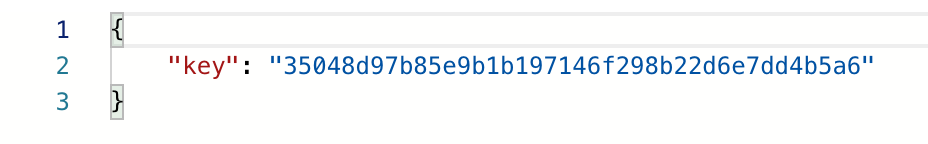

## API 가이드

1. Accounts

   - Signup

     > - URL : '/rest-auth/registration/'
     >
     > -  request
     >
     >   ```js
     >   header : 없음
     >   body : {
     >     username: "hwang0",
     >     password1: "sdfsdf123",
     >     password2: "sdfsdf123",
     >   }
     >   ```
     >
     > - response
     >
     >   
     >
     > 

   - Login

     > - URL
     >
     > - request
     >
     >   ```js
     >   header : 없음
     >   body : {
     >     username: "hwang0",
     >     password: "sdfsdf123",
     >   }
     >   ```
     >
     > - response
     >
     >   

