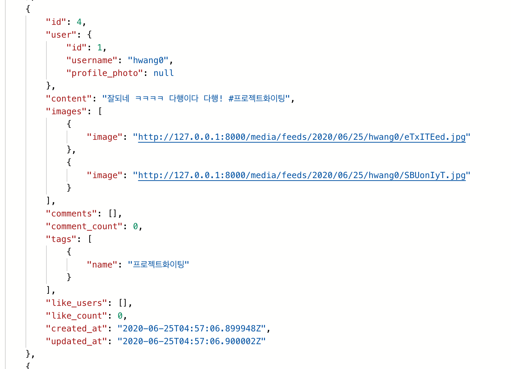

## API 가이드

1. Accounts

   - Signup

     > - URL : '/rest-auth/registration/'
     >
     > -  request
     >
     >   ```js
     >   body : {
     >     username: "hwang0",
     >     password1: "sdfsdf123",
     >     password2: "sdfsdf123",
     >   }
     >   ```
     >
     > - response
     >
     >   
     >
     > 

   - Login

     > - URL : '/rest-auth/login/'
     >
     > - request
     >
     >   ```js
     >   body : {
     >     username: "hwang0",
     >     password: "sdfsdf123",
     >   }
     >   ```
     >
     > - response
     >
     >   

2. Articles

   - Feed

     - get

       > - URL : '/articles/'
       >
       > - response
       >
       >   

     - post

       > - URL : '/articles/'
       >
       > - request
       >
       >   ```js
       >   header: {
       >     Authorization: Token `${token}`
       >   },
       >   body : {
       >     content: "잘되는지 테스트 #완성",
       >     image: "hh.png",
       >     image: "스크린샷 2020-06-22 오후 4.27.46.png"
       >   }
       >   ```
       >
       > - response
       >
       >   

   - FeedDetail

     - get

       > - URL : '/articles/:feed_pk'
       >
       > - response
       >
       >   ```
       >   {
       >       "id": 5,
       >       "user": {
       >           "id": 1,
       >           "username": "hwang0",
       >           "profile_photo": null,
       >           "feed_set": [
       >               {
       >                   "id": 6,
       >                   "images": [
       >                       {
       >                           "image": "/media/feeds/2020/06/25/hwang0/iLLrvXhO.jpg"
       >                       },
       >                       {
       >                           "image": "/media/feeds/2020/06/25/hwang0/ndiDOAgq.jpg"
       >                       }
       >                   ],
       >                   "like_count": 0,
       >                   "comment_count": 0
       >               },
       >               {
       >                   "id": 5,
       >                   "images": [
       >                       {
       >                           "image": "/media/feeds/2020/06/25/hwang0/hELlPyko.jpg"
       >                       },
       >                       {
       >                           "image": "/media/feeds/2020/06/25/hwang0/iMwAlsLj.jpg"
       >                       }
       >                   ],
       >                   "like_count": 0,
       >                   "comment_count": 0
       >               },
       >               {
       >                   "id": 4,
       >                   "images": [
       >                       {
       >                           "image": "/media/feeds/2020/06/25/hwang0/eTxITEed.jpg"
       >                       },
       >                       {
       >                           "image": "/media/feeds/2020/06/25/hwang0/SBUonIyT.jpg"
       >                       }
       >                   ],
       >                   "like_count": 0,
       >                   "comment_count": 0
       >               },
       >               {
       >                   "id": 3,
       >                   "images": [
       >                       {
       >                           "image": "/media/feeds/2020/06/25/hwang0/bnTlNiMQ.jpg"
       >                       },
       >                       {
       >                           "image": "/media/feeds/2020/06/25/hwang0/pcOwrfjq.jpg"
       >                       }
       >                   ],
       >                   "like_count": 0,
       >                   "comment_count": 0
       >               },
       >               {
       >                   "id": 2,
       >                   "images": [],
       >                   "like_count": 0,
       >                   "comment_count": 0
       >               },
       >               {
       >                   "id": 1,
       >                   "images": [],
       >                   "like_count": 0,
       >                   "comment_count": 0
       >               }
       >           ]
       >       },
       >       "content": "잘되네 ㅋㅋㅋㅋ 다행이다 다행! #재성화이팅 #종우화이팅 #커피빵화이팅",
       >       "images": [
       >           {
       >               "image": "/media/feeds/2020/06/25/hwang0/hELlPyko.jpg"
       >           },
       >           {
       >               "image": "/media/feeds/2020/06/25/hwang0/iMwAlsLj.jpg"
       >           }
       >       ],
       >       "comments": [],
       >       "comment_count": 0,
       >       "tags": [
       >           {
       >               "name": "재성화이팅"
       >           },
       >           {
       >               "name": "종우화이팅"
       >           },
       >           {
       >               "name": "커피빵화이팅"
       >           }
       >       ],
       >       "like_users": [],
       >       "like_count": 0,
       >       "created_at": "2020-06-25T05:00:43.558254Z",
       >       "updated_at": "2020-06-25T05:00:43.558300Z"
       >   }
       >   ```


