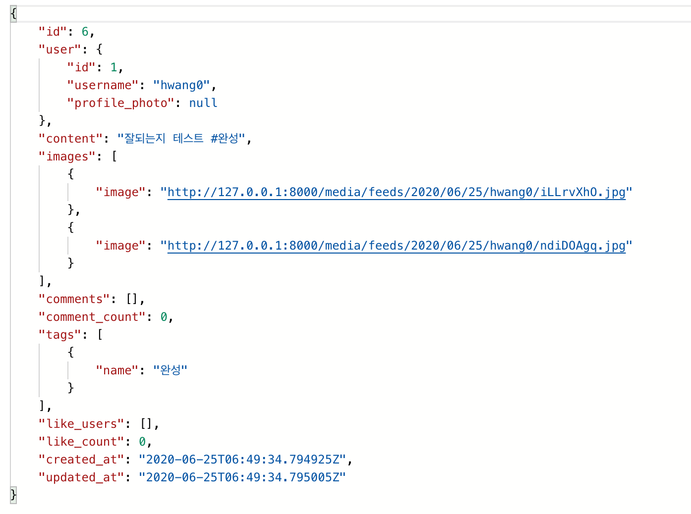

## API 가이드

1. Accounts

   - Signup

     > - URL : '/rest-auth/registration/'
     >
     > -  request
     >
     >   ```js
     >   body : {
     >     username: "hwang0",
     >     password1: "sdfsdf123",
     >     password2: "sdfsdf123",
     >   }
     >   ```
     >
     > - response
     >
     >   
     >
     > 

   - Login

     > - URL : '/rest-auth/login/'
     >
     > - request
     >
     >   ```js
     >   body : {
     >     username: "hwang0",
     >     password: "sdfsdf123",
     >   }
     >   ```
     >
     > - response
     >
     >   

   - UserDetail

     - get

       > - URL : '/accounts/:usename/'
       >
       > - response
       >
       >   ```js
       >   {
       >       "id": 1,
       >       "username": "hwang0",
       >       "profile_photo": "/media/profiles/hwang0/VZNIPFN2UXRU1539215883729.jpg",
       >       "name": "태이니",
       >       "gender": "male",
       >       "description": "안녕하세요 태이니입니당!",
       >       "followings": [],
       >       "followers": [
       >           {
       >               "id": 2,
       >               "username": "hwang00",
       >               "profile_photo": null
       >           }
       >       ],
       >       "followers_count": 1,
       >       "following_count": 0,
       >       "feed_set": [
       >           {
       >               "id": 10,
       >               "images": [],
       >               "like_count": 0,
       >               "comment_count": 0
       >           },
       >           {
       >               "id": 9,
       >               "images": [
       >                   {
       >                       "image": "/media/feeds/2020/06/26/hwang0/glimGUeV.jpg"
       >                   }
       >               ],
       >               "like_count": 0,
       >               "comment_count": 0
       >           },
       >           {
       >               "id": 8,
       >               "images": [],
       >               "like_count": 0,
       >               "comment_count": 0
       >           },
       >           {
       >               "id": 7,
       >               "images": [
       >                   {
       >                       "image": "/media/feeds/2020/06/26/hwang0/rgIxwVrN.jpg"
       >                   },
       >                   {
       >                       "image": "/media/feeds/2020/06/26/hwang0/UfdlNQdi.jpg"
       >                   }
       >               ],
       >               "like_count": 1,
       >               "comment_count": 3
       >           },
       >           {
       >               "id": 6,
       >               "images": [
       >                   {
       >                       "image": "/media/feeds/2020/06/25/hwang0/iLLrvXhO.jpg"
       >                   },
       >                   {
       >                       "image": "/media/feeds/2020/06/25/hwang0/ndiDOAgq.jpg"
       >                   }
       >               ],
       >               "like_count": 0,
       >               "comment_count": 4
       >           },
       >           {
       >               "id": 4,
       >               "images": [
       >                   {
       >                       "image": "/media/feeds/2020/06/25/hwang0/eTxITEed.jpg"
       >                   },
       >                   {
       >                       "image": "/media/feeds/2020/06/25/hwang0/SBUonIyT.jpg"
       >                   }
       >               ],
       >               "like_count": 0,
       >               "comment_count": 0
       >           },
       >           {
       >               "id": 3,
       >               "images": [
       >                   {
       >                       "image": "/media/feeds/2020/06/25/hwang0/bnTlNiMQ.jpg"
       >                   },
       >                   {
       >                       "image": "/media/feeds/2020/06/25/hwang0/pcOwrfjq.jpg"
       >                   }
       >               ],
       >               "like_count": 0,
       >               "comment_count": 0
       >           }
       >       ]
       >   }
       >   ```

     - put

       > - URL : '/accounts/:usename/'
       >
       > - request
       >
       >   ```js
       >   header: {
       >     Authorization: Token `${token}`
       >   },
       >   body: {
       >     profile_photo: "GVG_085.png",
       >     name: "인이",
       >     gender: "male",
       >     description: "안녕하세요 인이입니다. 잘부탁드려요!"
       >   }
       >   ```
       >
       > - response
       >
       >   ```js
       >   {
       >       "id": 1,
       >       "profile_photo": "/media/profiles/hwang0/GVG_085_SEY620E.jpg",
       >       "name": "인이",
       >       "gender": "male",
       >       "description": "안녕하세요 인이입니다. 잘부탁드려요!"
       >   }
       >   ```
       >
       >   

     - delete

   - Follow

     - post

       >- URL : '/accounts/:usename/follow/'
       >
       >- request
       >
       >  ```js
       >  header: {
       >    Authorization: Token `${token}`
       >  }
       >  ```

   - UnFollow

     - post

       > - URL : '/accounts/:usename/unfollow/'
       >
       > - request
       >
       >   ```js
       >   header: {
       >     Authorization: Token `${token}`
       >   }
       >   ```

2. Articles

   - Feed

     - get

       > - URL : '/articles/'
       >
       > - response
       >
       >   ```js
    >   [
       >   								........
    >       {
       >           "id": 7,
       >           "user": {
       >               "id": 1,
       >               "username": "hwang0",
       >               "profile_photo": "/media/profiles/hwang0/GVG_085_SEY620E.jpg"
       >           },
       >           "content": "대박 찬스! #꿀",
       >           "images": [
       >               {
       >                   "image": "/media/feeds/2020/06/26/hwang0/rgIxwVrN.jpg"
       >               },
       >               {
       >                   "image": "/media/feeds/2020/06/26/hwang0/UfdlNQdi.jpg"
       >               }
       >           ],
       >           "comments": [
       >               {
       >                   "id": 10,
    >                   "user": {
       >                       "id": 1,
    >                       "username": "hwang0",
       >                       "profile_photo": "/media/profiles/hwang0/GVG_085_SEY620E.jpg"
    >                   },
       >                   "content": "대박 잘되넹?",
       >                   "like_users": [],
       >                   "comment_like_count": 0,
       >                   "created_at": "2020-07-02T04:13:39.914548Z",
       >                   "updated_at": "2020-07-02T04:13:39.914598Z"
       >               },
       >               {
       >                   "id": 7,
       >                   "user": {
       >                       "id": 2,
       >                       "username": "hwang00",
       >                       "profile_photo": null
       >                   },
       >                   "content": "쩔어쩔어 7번",
       >                   "like_users": [
       >                       {
       >                           "id": 1,
       >                           "username": "hwang0",
       >                           "profile_photo": "/media/profiles/hwang0/GVG_085_SEY620E.jpg"
       >                       }
       >                   ],
       >                   "comment_like_count": 1,
       >                   "created_at": "2020-07-01T09:00:39.046221Z",
       >                   "updated_at": "2020-07-01T09:01:12.121298Z"
       >               },
       >               {
       >                   "id": 5,
       >                   "user": {
       >                       "id": 2,
       >                       "username": "hwang00",
       >                       "profile_photo": null
       >                   },
       >                   "content": "대박대",
       >                   "like_users": [],
       >                   "comment_like_count": 0,
       >                   "created_at": "2020-07-01T08:58:32.104433Z",
       >                   "updated_at": "2020-07-01T08:58:32.104505Z"
       >               },
       >               {
       >                   "id": 4,
       >                   "user": {
       >                       "id": 1,
       >                       "username": "hwang0",
       >                       "profile_photo": "/media/profiles/hwang0/GVG_085_SEY620E.jpg"
       >                   },
       >                   "content": "ㅋㅋㅋㅋ 잘되면 좋겠다 #정말루",
       >                   "like_users": [],
       >                   "comment_like_count": 0,
       >                   "created_at": "2020-06-26T14:17:05.228530Z",
       >                   "updated_at": "2020-06-26T14:17:05.228583Z"
       >               }
       >           ],
       >           "comment_count": 4,
       >           "tags": [
       >               {
       >                   "name": "꿀"
       >               }
       >           ],
       >           "like_users": [
       >               {
       >                   "id": 2,
       >                   "username": "hwang00",
       >                   "profile_photo": null
       >               }
       >           ],
       >           "like_count": 1,
       >           "created_at": "2020-06-26T09:45:05.333533Z",
       >           "updated_at": "2020-06-26T16:00:12.696651Z"
       >       },
       >       {
       >           "id": 6,
       >           "user": {
       >               "id": 1,
       >               "username": "hwang0",
       >               "profile_photo": "/media/profiles/hwang0/GVG_085_SEY620E.jpg"
       >           },
       >           "content": "잘되는지 테스트 #완성",
       >           "images": [
       >               {
       >                   "image": "/media/feeds/2020/06/25/hwang0/iLLrvXhO.jpg"
       >               },
       >               {
       >                   "image": "/media/feeds/2020/06/25/hwang0/ndiDOAgq.jpg"
       >               }
       >           ],
       >           "comments": [
       >               {
       >                   "id": 9,
       >                   "user": {
       >                       "id": 3,
       >                       "username": "marrywill",
       >                       "profile_photo": null
       >                   },
       >                   "content": "굿굿",
       >                   "like_users": [],
       >                   "comment_like_count": 0,
       >                   "created_at": "2020-07-01T10:24:30.809382Z",
       >                   "updated_at": "2020-07-01T10:24:30.809456Z"
       >               },
       >               {
       >                   "id": 3,
       >                   "user": {
       >                       "id": 2,
       >                       "username": "hwang00",
       >                       "profile_photo": null
       >                   },
    >                   "content": "세번째 댓글",
       >                   "like_users": [],
    >                   "comment_like_count": 0,
       >                   "created_at": "2020-06-25T08:34:22.497141Z",
       >                   "updated_at": "2020-06-25T08:34:22.497463Z"
       >               },
       >               {
       >                   "id": 2,
       >                   "user": {
       >                       "id": 2,
       >                       "username": "hwang00",
       >                       "profile_photo": null
       >                   },
       >                   "content": "ㅋㅋㅋㅋㅋLCK화이팅",
       >                   "like_users": [],
       >                   "comment_like_count": 0,
       >                   "created_at": "2020-06-25T08:10:45.068439Z",
       >                   "updated_at": "2020-06-25T08:10:45.068612Z"
       >               },
       >               {
       >                   "id": 1,
       >                   "user": {
       >                       "id": 2,
       >                       "username": "hwang00",
       >                       "profile_photo": null
       >                   },
       >                   "content": "좋아요 좋",
       >                   "like_users": [],
       >                   "comment_like_count": 0,
       >                   "created_at": "2020-06-25T08:10:23.545521Z",
       >                   "updated_at": "2020-06-25T08:10:23.545578Z"
       >               }
       >           ],
       >           "comment_count": 4,
       >           "tags": [
       >               {
       >                   "name": "완성"
       >               }
       >           ],
       >           "like_users": [],
       >           "like_count": 0,
       >           "created_at": "2020-06-25T06:49:34.794925Z",
       >           "updated_at": "2020-06-25T06:49:34.795005Z"
       >       },
       >   								........
       >   ]
       >   ```
       >   
       >   
   
     - post
   
       > - URL : '/articles/'
       >
       > - request
       >
       >   ```js
       >   header: {
       >     Authorization: Token `${token}`
       >   },
       >   body : {
       >     content: "잘되는지 테스트 #완성",
       >     image: "hh.png",
       >     image: "스크린샷 2020-06-22 오후 4.27.46.png"
       >   }
       >   ```
       >
       > - response
       >
       >   
   
   - FeedDetail
   
     - get
   
       > - URL : '/articles/:feed_pk/'
       >
       > - response
       >
       >   ```js
       >   {
       >       "id": 7,
       >       "user": {
       >           "id": 1,
       >           "username": "hwang0",
       >           "profile_photo": "/media/profiles/hwang0/GVG_085_SEY620E.jpg",
       >           "followers": [
       >               2
       >           ],
       >           "feed_set": [
       >               {
       >                   "id": 10,
       >                   "images": [],
       >                   "like_count": 0,
       >                   "comment_count": 0
       >               },
       >               {
       >                   "id": 9,
       >                   "images": [
       >                       {
       >                           "image": "/media/feeds/2020/06/26/hwang0/glimGUeV.jpg"
       >                       }
       >                   ],
       >                   "like_count": 0,
       >                   "comment_count": 0
       >               },
       >               {
       >                   "id": 8,
       >                   "images": [],
       >                   "like_count": 0,
       >                   "comment_count": 0
       >               },
       >               {
       >                   "id": 7,
       >                   "images": [
       >                       {
       >                           "image": "/media/feeds/2020/06/26/hwang0/rgIxwVrN.jpg"
       >                       },
       >                       {
       >                           "image": "/media/feeds/2020/06/26/hwang0/UfdlNQdi.jpg"
       >                       }
       >                   ],
       >                   "like_count": 1,
       >                   "comment_count": 4
       >               },
       >               {
       >                   "id": 6,
       >                   "images": [
       >                       {
       >                           "image": "/media/feeds/2020/06/25/hwang0/iLLrvXhO.jpg"
       >                       },
       >                       {
       >                           "image": "/media/feeds/2020/06/25/hwang0/ndiDOAgq.jpg"
       >                       }
       >                   ],
       >                   "like_count": 0,
       >                   "comment_count": 4
       >               },
    >               {
       >                   "id": 4,
    >                   "images": [
       >                       {
       >                           "image": "/media/feeds/2020/06/25/hwang0/eTxITEed.jpg"
       >                       },
       >                       {
       >                           "image": "/media/feeds/2020/06/25/hwang0/SBUonIyT.jpg"
       >                       }
       >                   ],
       >                   "like_count": 0,
       >                   "comment_count": 0
    >               },
       >               {
    >                   "id": 3,
       >                   "images": [
    >                       {
       >                           "image": "/media/feeds/2020/06/25/hwang0/bnTlNiMQ.jpg"
       >                       },
       >                       {
       >                           "image": "/media/feeds/2020/06/25/hwang0/pcOwrfjq.jpg"
       >                       }
       >                   ],
       >                   "like_count": 0,
       >                   "comment_count": 0
       >               }
       >           ]
       >       },
       >       "content": "대박 찬스! #꿀",
       >       "images": [
       >           {
       >               "image": "/media/feeds/2020/06/26/hwang0/rgIxwVrN.jpg"
       >           },
       >           {
       >               "image": "/media/feeds/2020/06/26/hwang0/UfdlNQdi.jpg"
       >           }
       >       ],
       >       "comments": [
       >           {
       >               "id": 10,
       >               "user": {
       >                   "id": 1,
       >                   "username": "hwang0",
       >                   "profile_photo": "/media/profiles/hwang0/GVG_085_SEY620E.jpg"
       >               },
       >               "content": "대박 잘되넹?",
       >               "like_users": [],
    >               "comment_like_count": 0,
       >               "created_at": "2020-07-02T04:13:39.914548Z",
    >               "updated_at": "2020-07-02T04:13:39.914598Z"
       >           },
       >           {
       >               "id": 7,
       >               "user": {
       >                   "id": 2,
       >                   "username": "hwang00",
       >                   "profile_photo": null
       >               },
       >               "content": "쩔어쩔어 7번",
       >               "like_users": [
       >                   {
       >                       "id": 1,
       >                       "username": "hwang0",
       >                       "profile_photo": "/media/profiles/hwang0/GVG_085_SEY620E.jpg"
       >                   }
       >               ],
       >               "comment_like_count": 1,
       >               "created_at": "2020-07-01T09:00:39.046221Z",
       >               "updated_at": "2020-07-01T09:01:12.121298Z"
       >           },
       >           {
       >               "id": 5,
       >               "user": {
       >                   "id": 2,
       >                   "username": "hwang00",
       >                   "profile_photo": null
       >               },
       >               "content": "대박대",
    >               "like_users": [],
       >               "comment_like_count": 0,
    >               "created_at": "2020-07-01T08:58:32.104433Z",
       >               "updated_at": "2020-07-01T08:58:32.104505Z"
    >           },
       >           {
    >               "id": 4,
       >               "user": {
       >                   "id": 1,
       >                   "username": "hwang0",
       >                   "profile_photo": "/media/profiles/hwang0/GVG_085_SEY620E.jpg"
       >               },
       >               "content": "ㅋㅋㅋㅋ 잘되면 좋겠다 #정말루",
       >               "like_users": [],
       >               "comment_like_count": 0,
       >               "created_at": "2020-06-26T14:17:05.228530Z",
    >               "updated_at": "2020-06-26T14:17:05.228583Z"
       >           }
    >       ],
       >       "comment_count": 4,
    >       "tags": [
       >           {
       >               "name": "꿀"
       >           }
       >       ],
       >       "like_users": [
       >           {
       >               "id": 2,
       >               "username": "hwang00",
       >               "profile_photo": null
       >           }
       >       ],
    >       "like_count": 1,
       >       "created_at": "2020-06-26T09:45:05.333533Z",
    >       "updated_at": "2020-06-26T16:00:12.696651Z"
       >   }
    >   ```
   
     - put
   
       > - URL : '/articles/:feed_pk/'
       >
       > - request
       >
       >   ```js
       >   header: {
    >     Authorization: Token `${token}`
       >   },
    >   body : {
       >     content: "수정 잘되니? #잘됌",
    >   }
       >   ```
       >
       > - response
       >
       >   ```js
       >   {
       >       "id": 7,
       >       "user": {
       >           "id": 1,
       >           "username": "hwang0",
       >           "profile_photo": "/media/profiles/hwang0/GVG_085_SEY620E.jpg",
       >           "followers": [
       >               2
       >           ],
       >           "feed_set": [
       >               {
       >                   "id": 10,
       >                   "images": [],
       >                   "like_count": 0,
       >                   "comment_count": 0
       >               },
       >               {
       >                   "id": 9,
       >                   "images": [
       >                       {
       >                           "image": "/media/feeds/2020/06/26/hwang0/glimGUeV.jpg"
       >                       }
       >                   ],
       >                   "like_count": 0,
       >                   "comment_count": 0
       >               },
       >               {
       >                   "id": 8,
       >                   "images": [],
       >                   "like_count": 0,
       >                   "comment_count": 0
       >               },
       >               {
       >                   "id": 7,
       >                   "images": [
       >                       {
       >                           "image": "/media/feeds/2020/06/26/hwang0/rgIxwVrN.jpg"
       >                       },
       >                       {
       >                           "image": "/media/feeds/2020/06/26/hwang0/UfdlNQdi.jpg"
       >                       }
       >                   ],
       >                   "like_count": 1,
       >                   "comment_count": 4
       >               },
       >               {
       >                   "id": 6,
       >                   "images": [
       >                       {
       >                           "image": "/media/feeds/2020/06/25/hwang0/iLLrvXhO.jpg"
       >                       },
       >                       {
       >                           "image": "/media/feeds/2020/06/25/hwang0/ndiDOAgq.jpg"
       >                       }
       >                   ],
       >                   "like_count": 0,
       >                   "comment_count": 4
       >               },
       >               {
       >                   "id": 4,
       >                   "images": [
       >                       {
       >                           "image": "/media/feeds/2020/06/25/hwang0/eTxITEed.jpg"
       >                       },
       >                       {
       >                           "image": "/media/feeds/2020/06/25/hwang0/SBUonIyT.jpg"
       >                       }
       >                   ],
       >                   "like_count": 0,
       >                   "comment_count": 0
       >               },
       >               {
       >                   "id": 3,
       >                   "images": [
       >                       {
       >                           "image": "/media/feeds/2020/06/25/hwang0/bnTlNiMQ.jpg"
       >                       },
       >                       {
       >                           "image": "/media/feeds/2020/06/25/hwang0/pcOwrfjq.jpg"
       >                       }
       >                   ],
       >                   "like_count": 0,
       >                   "comment_count": 0
       >               }
       >           ]
       >       },
       >       "content": "수정 잘되니? #잘됌",
       >       "images": [
       >           {
       >               "image": "/media/feeds/2020/06/26/hwang0/rgIxwVrN.jpg"
       >           },
       >           {
       >               "image": "/media/feeds/2020/06/26/hwang0/UfdlNQdi.jpg"
       >           }
       >       ],
       >       "comments": [
       >           {
       >               "id": 10,
       >               "user": {
       >                   "id": 1,
       >                   "username": "hwang0",
       >                   "profile_photo": "/media/profiles/hwang0/GVG_085_SEY620E.jpg"
       >               },
       >               "content": "대박 잘되넹?",
       >               "like_users": [],
       >               "comment_like_count": 0,
       >               "created_at": "2020-07-02T04:13:39.914548Z",
       >               "updated_at": "2020-07-02T04:13:39.914598Z"
       >           },
       >           {
       >               "id": 7,
       >               "user": {
       >                   "id": 2,
       >                   "username": "hwang00",
       >                   "profile_photo": null
       >               },
       >               "content": "쩔어쩔어 7번",
       >             "like_users": [
       >                   {
       >                       "id": 1,
       >                       "username": "hwang0",
       >                       "profile_photo": "/media/profiles/hwang0/GVG_085_SEY620E.jpg"
       >                   }
       >               ],
       >               "comment_like_count": 1,
       >               "created_at": "2020-07-01T09:00:39.046221Z",
       >               "updated_at": "2020-07-01T09:01:12.121298Z"
       >           },
       >           {
       >               "id": 5,
       >               "user": {
       >                   "id": 2,
       >                   "username": "hwang00",
       >                   "profile_photo": null
       >               },
       >               "content": "대박대",
       >               "like_users": [],
       >               "comment_like_count": 0,
       >               "created_at": "2020-07-01T08:58:32.104433Z",
       >               "updated_at": "2020-07-01T08:58:32.104505Z"
       >           },
       >           {
       >               "id": 4,
       >               "user": {
       >                   "id": 1,
       >                   "username": "hwang0",
       >                   "profile_photo": "/media/profiles/hwang0/GVG_085_SEY620E.jpg"
       >               },
       >               "content": "ㅋㅋㅋㅋ 잘되면 좋겠다 #정말루",
       >               "like_users": [],
       >               "comment_like_count": 0,
       >               "created_at": "2020-06-26T14:17:05.228530Z",
       >               "updated_at": "2020-06-26T14:17:05.228583Z"
       >           }
       >       ],
       >       "comment_count": 4,
       >       "tags": [
       >           {
       >               "name": "잘됌"
       >           }
       >       ],
       >       "like_users": [
       >           {
       >               "id": 2,
       >               "username": "hwang00",
       >               "profile_photo": null
       >           }
       >       ],
       >       "like_count": 1,
       >       "created_at": "2020-06-26T09:45:05.333533Z",
       >       "updated_at": "2020-06-26T16:00:12.696651Z"
       >   }
       >   ```
       >   
       >   
   
     - delete
   
       > - URL : '/articles/:feed_pk/'
       >
       > - request
       >
       >   ```js
       >   header: {
       >     Authorization: Token `${token}`
       >   }
       >   ```
   
   - FeedComment
   
     - get
   
       > - URL : '/articles/:feed_pk/comments/'
       >
       > - response
       >
       >   ```js
       >   [
       >       {
       >           "id": 7,
       >           "user": {
       >               "id": 2,
       >               "username": "hwang00",
       >               "profile_photo": null
       >           },
       >           "content": "쩔어쩔어 7번",
       >           "like_users": [],
       >           "comment_like_count": 0,
       >           "created_at": "2020-07-01T09:00:39.046221Z",
       >           "updated_at": "2020-07-01T09:01:12.121298Z"
       >       },
       >       {
       >           "id": 5,
       >           "user": {
       >               "id": 2,
       >               "username": "hwang00",
       >               "profile_photo": null
       >           },
       >           "content": "대박대",
       >           "like_users": [],
       >           "comment_like_count": 0,
       >           "created_at": "2020-07-01T08:58:32.104433Z",
       >           "updated_at": "2020-07-01T08:58:32.104505Z"
       >       },
       >       {
       >           "id": 4,
       >           "user": {
       >               "id": 1,
       >               "username": "hwang0",
       >               "profile_photo": "/media/profiles/hwang0/GVG_085_SEY620E.jpg"
       >           },
       >           "content": "ㅋㅋㅋㅋ 잘되면 좋겠다 #정말루",
       >           "like_users": [],
       >           "comment_like_count": 0,
       >           "created_at": "2020-06-26T14:17:05.228530Z",
       >           "updated_at": "2020-06-26T14:17:05.228583Z"
       >       }
       >   ]
       >   ```
   
     - post
   
       > - URL : '/articles/:feed_pk/comments/'
       >
       > - request
       >
       >   ```js
       >   header: {
       >     Authorization: Token `${token}`
       >   },
       >   body : {
       >     content: "대박 잘되넹?",
       >   }
       >   ```
       >
       > - response
       >
       >   ```js
       >   {
       >       "id": 10,
       >       "user": {
       >           "id": 1,
       >           "username": "hwang0",
       >           "profile_photo": "/media/profiles/hwang0/GVG_085_SEY620E.jpg"
       >       },
       >       "content": "대박 잘되넹?",
       >       "like_users": [],
       >       "comment_like_count": 0,
       >       "created_at": "2020-07-02T04:13:39.914548Z",
       >       "updated_at": "2020-07-02T04:13:39.914598Z"
       >   }
       >   ```
   
   - FeedCommentDetail
   
     - put
   
     - delete
   
       > - URL : '/articles/:feed_pk/comments/:comment_pk/'
       >
       > - request
       >
       >   ```js
       >   headers: {
       >     Authorization: Token `${token}`
       >   }
       >   ```
   
   - FeedLike
   
     - post
   
       >- URL : '/articles/:feed_pk/like/'
       >
       >- request
       >
       > ```js
       > headers: {
       >    Authorization: Token `${token}`
       >  }
       >  ```
     
   - FeedUnLike
   
     - post
   
       > - URL : '/articles/:feed_pk/unlike/'
       >
       > - request
       >
       >   ```js
       >   headers: {
       >     Authorization: Token `${token}`
       >   }
       >   ```
   
   - FeedCommentLike
   
     - post
   
       > - URL : '/articles/:feed_pk/comments/:comment_pk/like/'
       >
       > - request
       >
       >   ```js
       >   headers: {
       >     Authorization: Token `${token}`
       >   }
       >   ```
   
   - FeedCommentUnLike
   
     - post
   
       > - URL :  '/articles/:feed_pk/comments/:comment_pk/unlike/'
       >
       > - request
       >
       >   ```js
       >   headers: {
       >     Authorization: Token `${token}`
       >   }
       >   ```
